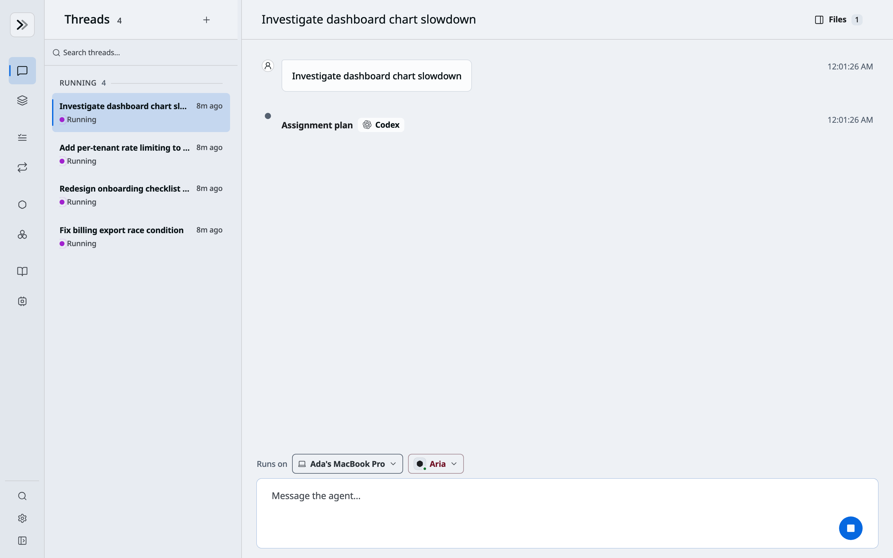
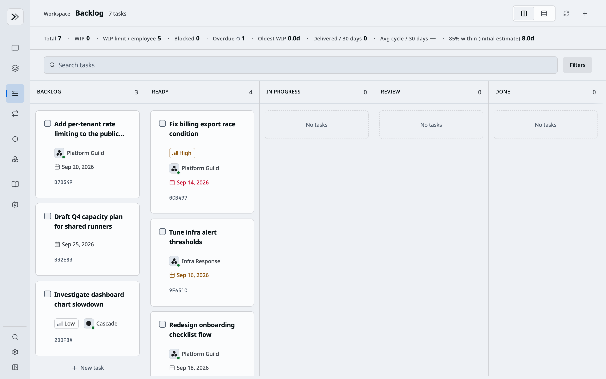
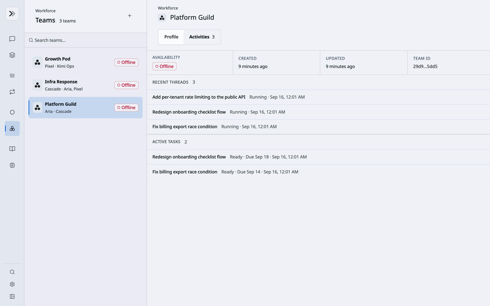

# Relay

<p align="center">
  
</p>

<p align="center"><strong>Every Employee. Amplified.</strong></p>

<p align="center">
  <a href="README.md">English</a> ·
  <a href="README.zh-CN.md">简体中文</a>
</p>

Relay is a local-first control plane for AI work. Employees start threads, assign persistent tasks, schedule routines, and coordinate named AI agents and teams from one interface — while Relay records identity, approvals, and history, and tracks which computer hosts each agent.

Relay daemons run [Claude Code](https://github.com/anthropics/claude-code), Codex, Pi, and Kimi on local or managed computers, inside [BoxLite](https://github.com/boxlite-ai/boxlite) sandboxes or a configured local environment.

## Features

| | |
|---|---|
| **Threads** | Start a thread with an explicit agent and computer. The agent decides whether the goal needs an answer, investigation, workspace changes, validation, review, or a clarifying question. Stream tool output, approve decisions, cancel or retry work, and hand the thread to another agent. |
| **Tasks & routines** | Plan work in a backlog, schedule recurring routines, assign agents or teams, set due dates, and follow dispatch and event history. |
| **Agents & teams** | Create named agents and teams with profiles, computer placement, workspace files, generated artifacts, and recent activity. |
| **Projects** | Bind a persistent shared workspace and an ordered roster of project agents to one computer, then run project conversations that share that workspace. |
| **Skills** | Publish reusable skill bundles, inspect their files and versions, and grant them to individual agents or teams from a shared library. |
| **Computers** | Enroll employee computers or reconcile managed computers while tracking health, capacity, command leases, and durable identity. |
| **Chat gateway** | Connect Discord, Telegram, and Lark through one gateway that maps external identities and conversations to Relay. |
| **Administration** | Operate employees, agents, computers, fleet health, activity, and token usage from one admin area. |

## Product snapshots

### Start and direct a thread

Choose where work runs and which named agent or team handles it; Relay gives the goal to the selected participants and lets each agent choose the appropriate execution path.

<p align="center">
  
</p>

### Plan and dispatch work

The backlog keeps priority, assignment, due date, status, and dispatch context in one view.

<p align="center">
  
</p>

### Coordinate agent teams

A team workspace gathers the team's active runs, recent threads, and open tasks in one view.

<p align="center">
  
</p>

## Quick start

Prerequisites: Node.js 22.19+, npm, Python 3.12+, [uv](https://docs.astral.sh/uv/), PostgreSQL, credentials for the agent CLIs you want to run, and — for the daemon's default BoxLite sandbox — Docker with hardware virtualization.

```bash
npm install
npm run build
```

Copy the environment examples and add your agent credentials (details in [Local Development](docs/local-development.md)):

```bash
cp backend/.env.example backend/.env
cp web/.env.example web/.env.local
cp packages/.env.example packages/.env
```

Sessions, tasks, events, and artifacts always live in PostgreSQL. Create the database that `RELAY_DATABASE_URL` in `backend/.env` names — the example expects role `relay` and database `relay` on `localhost:5432` — then apply the schema:

```bash
make backend-migrate
```

Create the first admin account (there is no default password):

```bash
script/init_users.sh --password 'choose-a-strong-password'
```

Start each service in its own terminal:

```bash
make backend                     # control plane on 127.0.0.1:8790
make daemon SANDBOX_ID=node_dev  # execution node connected to the backend
make web                         # web UI on 127.0.0.1:5000
```

Open <http://127.0.0.1:5000> and sign in as `admin`.

Tests, database migrations, the supervisor, pre-commit hooks, and shutdown commands are covered in [Local Development](docs/local-development.md).

## Deployment

[`docs/deployment.md`](docs/deployment.md) covers hosting the web UI on Vercel and the backend plus Postgres on Railway. Daemons stay off both platforms — they run wherever the sandbox lives and connect out to the backend URL.

## Documentation

Start with the [`docs/` index](docs/README.md) for the canonical setup, API, architecture, chat-integration, design, and decision documents.

## License

[MIT](LICENSE)
