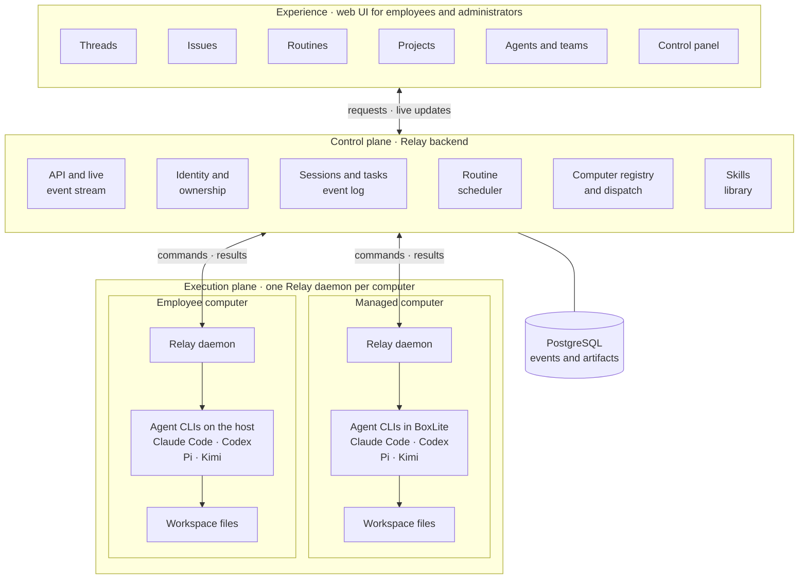

# Relay

<p align="center">
  
</p>

<p align="center"><strong>Every Employee. Amplified.</strong></p>

<p align="center">
  <a href="README.md">English</a> ·
  <a href="README.zh-CN.md">简体中文</a>
</p>

Relay is a local-first control plane for AI work. Employees direct named AI agents through threads, issues, routines, and projects, and the organization keeps one record of who asked for what, which agent did it, on which computer, and what it produced.

Agents run where the work already lives. A Relay daemon on an employee's computer or a managed computer runs [Claude Code](https://github.com/anthropics/claude-code), Codex, Pi, and Kimi in a real workspace — on the host, or inside a [BoxLite](https://github.com/boxlite-ai/boxlite) sandbox.

<p align="center">
  
</p>

## Features

- **Threads** — Work with an agent, a team, or a project on the computer you choose. Watch reasoning, commands, and tool calls stream; stop, retry, or hand off at any point.
- **Issues** — Track work with priority, due date, and an agent or team assignee, from backlog to done, with run history and produced files.
- **Routines** — Schedule recurring work daily, weekly, or monthly; Relay dispatches each run to its assignee.
- **Projects** — Bind a shared workspace and a roster of agents to one computer.
- **Agents and teams** — Give each agent a runtime, role, personality, and skills. Group agents into teams that work Solo, Build → Review, Pipeline, or Lead-led.
- **Skills** — Publish versioned skill bundles and grant them to agents from a shared library.
- **Computers** — Enroll employee or managed computers and see their health, runtimes, and running work.
- **Administration** — Manage employees, computers, activity, and token usage from one control panel.

## Architecture

Relay has three layers: people work in the web UI, the backend decides and records, and daemons on real computers do the work.


```mermaid
flowchart TB
  subgraph experience["Experience · web UI for employees and administrators"]
    direction TB
    threads["Threads"]
    issues["Issues"]
    routines["Routines"]
    projects["Projects"]
    workforce["Agents and teams"]
    admin["Control panel"]
  end

  subgraph control["Control plane · Relay backend"]
    direction TB
    api["API and live<br/>event stream"]
    identity["Identity and<br/>ownership"]
    records["Sessions and tasks<br/>event log"]
    scheduler["Routine<br/>scheduler"]
    registry["Computer registry<br/>and dispatch"]
    skills["Skills<br/>library"]
  end

  store[("PostgreSQL<br/>events and artifacts")]

  subgraph execution["Execution plane · one Relay daemon per computer"]
    direction TB
    subgraph managed["Managed computer"]
      managedDaemon["Relay daemon"]
      managedAgents["Agent CLIs in BoxLite<br/>Claude Code · Codex<br/>Pi · Kimi"]
      managedWorkspace["Workspace files"]
      managedDaemon --> managedAgents --> managedWorkspace
    end
    subgraph local["Employee computer"]
      localDaemon["Relay daemon"]
      localAgents["Agent CLIs on the host<br/>Claude Code · Codex<br/>Pi · Kimi"]
      localWorkspace["Workspace files"]
      localDaemon --> localAgents --> localWorkspace
    end
  end

  experience <-->|"requests · live updates"| control
  control <-->|"commands · results"| localDaemon
  control <-->|"commands · results"| managedDaemon
  control --- store
```

The backend never executes an agent. It writes every state change to an event log in PostgreSQL and dispatches runs; each daemon connects out, polls for commands, runs the agent CLI in its workspace, and reports results back. See [System Architecture](docs/system-architecture.md) for details.

## Product tour

<table>
  <tr>
    <td width="50%" valign="top">
      
      <br><strong>Issues</strong><br>Every open issue across projects, with queues for what needs you.
    </td>
    <td width="50%" valign="top">
      
      <br><strong>Projects</strong><br>A project board from backlog to done, with flow metrics.
    </td>
  </tr>
  <tr>
    <td width="50%" valign="top">
      
      <br><strong>Routines</strong><br>Recurring work with its cadence, next run, and assignee.
    </td>
    <td width="50%" valign="top">
      
      <br><strong>Agents</strong><br>Runtime, host computer, role, personality, and skills.
    </td>
  </tr>
  <tr>
    <td width="50%" valign="top">
      
      <br><strong>Teams</strong><br>Members, responsibilities, and how work moves between them.
    </td>
    <td width="50%" valign="top">
      
      <br><strong>Skills</strong><br>Versioned bundles with their files and revision history.
    </td>
  </tr>
  <tr>
    <td width="50%" valign="top">
      
      <br><strong>Computers</strong><br>What each computer is running and which runtimes are ready.
    </td>
    <td width="50%" valign="top">
      
      <br><strong>Control panel</strong><br>Thread volume, fleet health, and token usage.
    </td>
  </tr>
</table>

Snapshots show demo data and are generated by [`script/readme-snapshots`](script/readme-snapshots/capture.mjs).

## Quick start

Prerequisites: Node.js 22.19+, npm, Python 3.12+, [uv](https://docs.astral.sh/uv/), PostgreSQL, credentials for the agent CLIs you want to run, and — for the daemon's default BoxLite sandbox — Docker with hardware virtualization.

```bash
npm install
npm run build
```

Copy the environment examples and add your agent credentials (details in [Local Development](docs/local-development.md)):

```bash
cp backend/.env.example backend/.env
cp web/.env.example web/.env.local
cp packages/.env.example packages/.env
```

Sessions, tasks, events, and artifacts always live in PostgreSQL. Create the database that `RELAY_DATABASE_URL` in `backend/.env` names — the example expects role `relay` and database `relay` on `localhost:5432` — then apply the schema:

```bash
make backend-migrate
```

Create the first admin account (there is no default password):

```bash
script/init_users.sh --password 'choose-a-strong-password'
```

Start each service in its own terminal:

```bash
make backend                     # control plane on 127.0.0.1:8790
make daemon SANDBOX_ID=node_dev  # execution node connected to the backend
make web                         # web UI on 127.0.0.1:5000
```

Open <http://127.0.0.1:5000> and sign in as `admin`.

Tests, database migrations, the supervisor, pre-commit hooks, and shutdown commands are covered in [Local Development](docs/local-development.md).

## Project structure

```
backend/     Python / FastAPI control plane: API routes, event-sourced stores, scheduler, migrations
packages/    TypeScript workspaces
  relay-core/        Shared protocol, agent registry, CLI commands, prompts
  relay-daemon/      Execution plane: registers a computer and runs agent CLIs
  relay-supervisor/  Keeps employee daemons provisioned and running
web/         Next.js web UI, exported statically and served by the backend
docs/        Architecture, API, deployment, design system, and ADRs
script/      User bootstrap, demo seeding, README snapshot generator
devbox/      The BoxLite guest image that sandboxed agents run in
```

## Contributing

1. Get the stack running with the [quick start](#quick-start).
2. Read [`CLAUDE.md`](CLAUDE.md) for the invariants the codebase depends on, and [`docs/adr/`](docs/adr/README.md) for past design decisions.
3. Run `npm test` (TypeScript and Python suites) and `make pre-commit-run` before opening a pull request.
4. Update the matching page under [`docs/`](docs/README.md) when behavior changes.

## Deployment

[`docs/deployment.md`](docs/deployment.md) covers hosting the web UI on Vercel and the backend plus Postgres on Railway. Daemons stay off both platforms — they run wherever the sandbox lives and connect out to the backend URL.

## Documentation

Start with the [`docs/` index](docs/README.md) for the canonical setup, API, architecture, design, and decision documents.

## License

[MIT](LICENSE)
