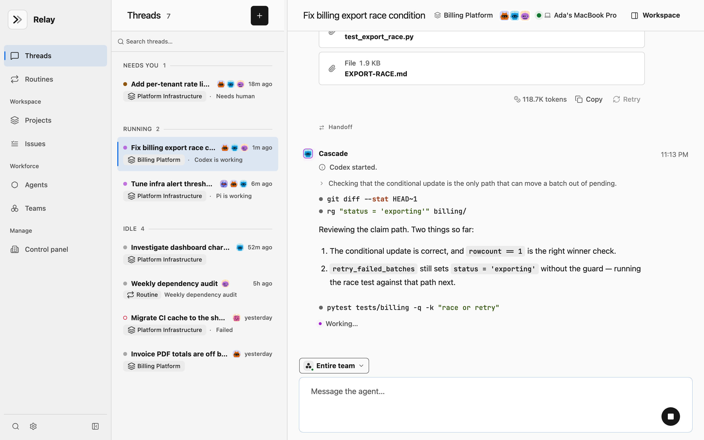
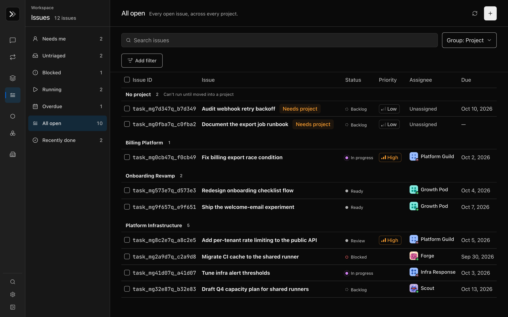
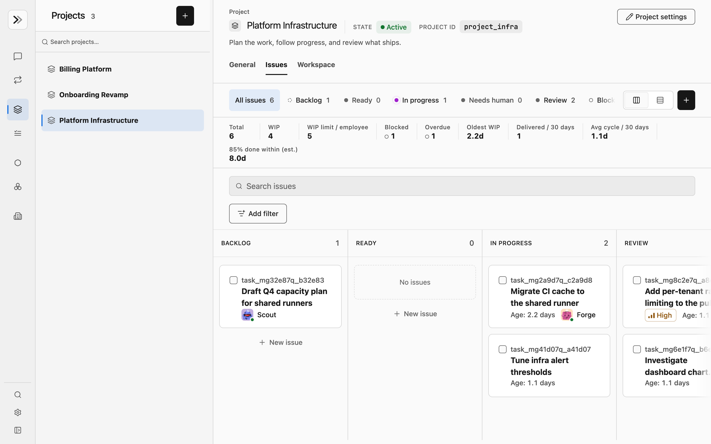
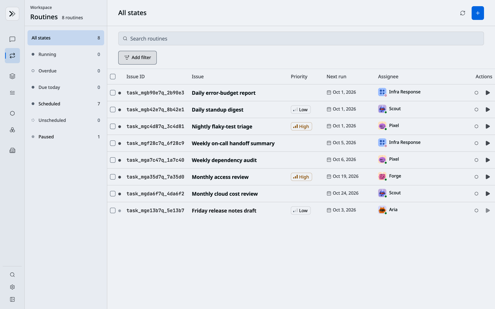
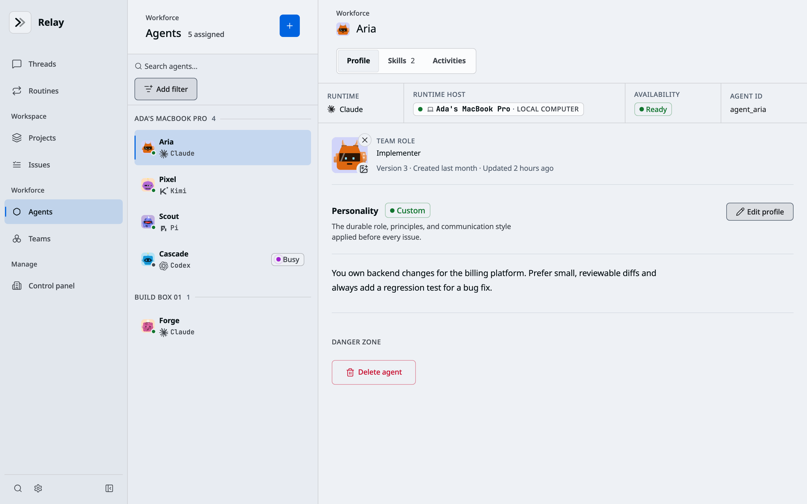
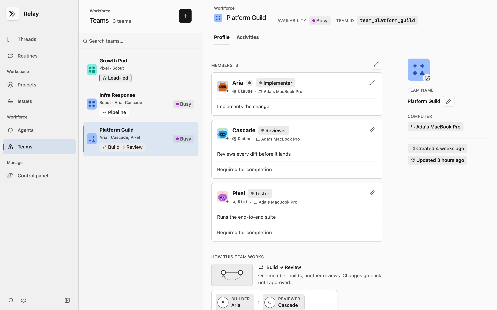
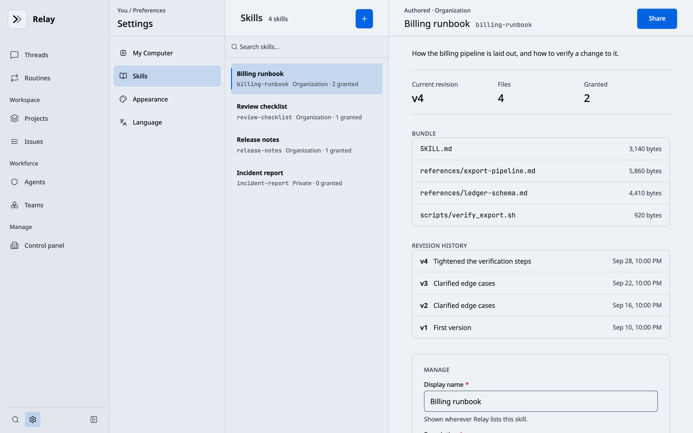
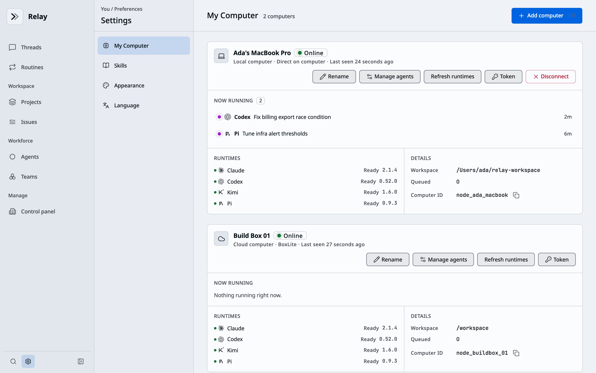
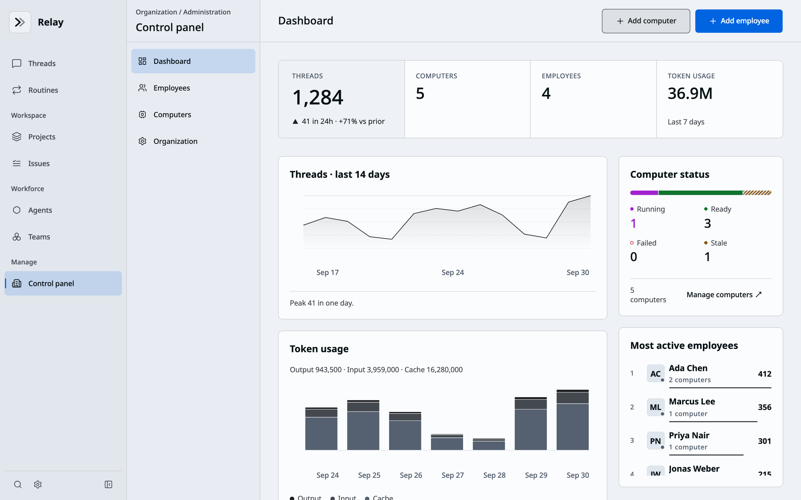

# Relay

<p align="center">
  
</p>

<p align="center"><strong>Every Employee. Amplified.</strong></p>

<p align="center">
  <a href="README.md">English</a> ·
  <a href="README.zh-CN.md">简体中文</a>
</p>

Relay helps employees work with AI agents across threads, tasks, automations, and projects. Give agents names, roles, and skills, choose where they run, and keep a shared record of requests, runs, and results.

Relay uses a local-first architecture: the backend coordinates work, and daemons execute it on employee or managed computers. Each daemon runs [Claude Code](https://github.com/anthropics/claude-code), Codex, Pi, or Kimi in a workspace on the host or inside a [BoxLite](https://github.com/boxlite-ai/boxlite) sandbox.

<p align="center">
  
</p>

## Features

- **Threads** — Work with an agent, a team, or a project on the computer you choose. Follow streamed reasoning, commands, and tool calls. Stop, retry, or hand off work as needed.
- **Tasks** — Assign work to an agent or team, set priorities and due dates, and track it from backlog to done. Keep run history and output files with each task.
- **Automations** — Schedule recurring work daily, weekly, or monthly; Relay dispatches each run to its assignee.
- **Projects** — Bring a shared workspace and a roster of agents together on one computer.
- **Agents and teams** — Give each agent a runtime, role, personality, and skills. Group agents into teams that work Solo, Build → Review, Pipeline, or Lead-led.
- **Skills** — Publish versioned skill bundles and grant them to agents from a shared library.
- **Computers** — Enroll employee or managed computers and see their health, runtimes, and running work.
- **Administration** — Manage employees, computers, activity, and token usage from one Admin Console.

## Product tour

<table>
  <tr>
    <td width="50%" valign="top">
      
      <br><strong>Tasks</strong><br>Open tasks across projects, with queues for work that needs your attention.
    </td>
    <td width="50%" valign="top">
      
      <br><strong>Projects</strong><br>A project board from backlog to done, with flow metrics.
    </td>
  </tr>
  <tr>
    <td width="50%" valign="top">
      
      <br><strong>Automations</strong><br>Recurring work with its cadence, next run, and assignee.
    </td>
    <td width="50%" valign="top">
      
      <br><strong>Agents</strong><br>Runtime, host computer, role, personality, and skills.
    </td>
  </tr>
  <tr>
    <td width="50%" valign="top">
      
      <br><strong>Teams</strong><br>Members, responsibilities, and how work moves between them.
    </td>
    <td width="50%" valign="top">
      
      <br><strong>Skills</strong><br>Versioned bundles with their files and revision history.
    </td>
  </tr>
  <tr>
    <td width="50%" valign="top">
      
      <br><strong>Computers</strong><br>What each computer is running and which runtimes are ready.
    </td>
    <td width="50%" valign="top">
      
      <br><strong>Admin Console</strong><br>Thread volume, fleet health, and token usage.
    </td>
  </tr>
</table>

These screenshots use demo data and the dark theme. Generate them with [`script/readme-snapshots`](script/readme-snapshots/capture.mjs).

## Quick start

You need Node.js 22.19+, npm, Python 3.12+, [uv](https://docs.astral.sh/uv/), and PostgreSQL. For the default BoxLite sandbox, you also need Docker, hardware virtualization, and credentials for the agents you plan to use.

Run the following commands from the repository root.

### 1. Install and configure

```bash
npm install
npm run build
```

Copy the environment examples and add your agent credentials (details in [Local Development](docs/local-development.md)):

```bash
cp backend/.env.example backend/.env
cp web/.env.example web/.env.local
cp packages/.env.example packages/.env
```

### 2. Prepare the database and admin account

Relay stores sessions, tasks, events, and artifacts in PostgreSQL. Create the role and database specified by `RELAY_DATABASE_URL` in `backend/.env`. The example uses role `relay` and database `relay` on `localhost:5432`. Then apply the migrations:

```bash
make backend-migrate
```

Create the first admin account (there is no default password):

```bash
script/init_users.sh --password 'choose-a-strong-password'
```

### 3. Start the services

Start each service in its own terminal:

```bash
make backend                     # control plane on 127.0.0.1:8790
make daemon SANDBOX_ID=node_dev  # execution node connected to the backend
make web                         # web UI on 127.0.0.1:5000
```

Open <http://127.0.0.1:5000> and sign in as `admin`.

Tests, database migrations, the supervisor, pre-commit hooks, and shutdown commands are covered in [Local Development](docs/local-development.md).

## Project structure

```
backend/     Python / FastAPI control plane: API routes, event-sourced stores, scheduler, migrations
packages/    TypeScript workspaces
  relay-core/        Shared protocol, agent registry, CLI commands, prompts
  relay-chat/        Chat gateway and Discord, Telegram, and Lark adapters
  relay-daemon/      Execution plane: registers a computer and runs agent CLIs
  relay-supervisor/  Keeps employee daemons provisioned and running
web/         Next.js web UI, exported statically and served by the backend
docs/        Architecture, API, deployment, design system, and ADRs
script/      User bootstrap, demo seeding, README snapshot generator
devbox/      The BoxLite guest image that sandboxed agents run in
```

## Contributing

1. Get the stack running with the [quick start](#quick-start).
2. Read [`AGENTS.md`](AGENTS.md) for repository guidance and invariants, and [`docs/adr/`](docs/adr/README.md) for past design decisions.
3. Run `npm test` (TypeScript and Python suites) and `make pre-commit-run` before opening a pull request.
4. Update the matching page under [`docs/`](docs/README.md) when behavior changes.

[`CONTRIBUTING.md`](CONTRIBUTING.md) has the detailed layout and a guide to where each kind of change starts.

## Deployment

[`docs/deployment.md`](docs/deployment.md) covers hosting the web UI on Vercel and the backend plus Postgres on Railway. Run daemons on the computers that execute your agents; they connect to the backend over outbound HTTP(S).

## Documentation

Start with the [`docs/` index](docs/README.md) for the canonical setup, API, architecture, design, and decision documents.

## License

[AGPL-3.0-only](LICENSE)
