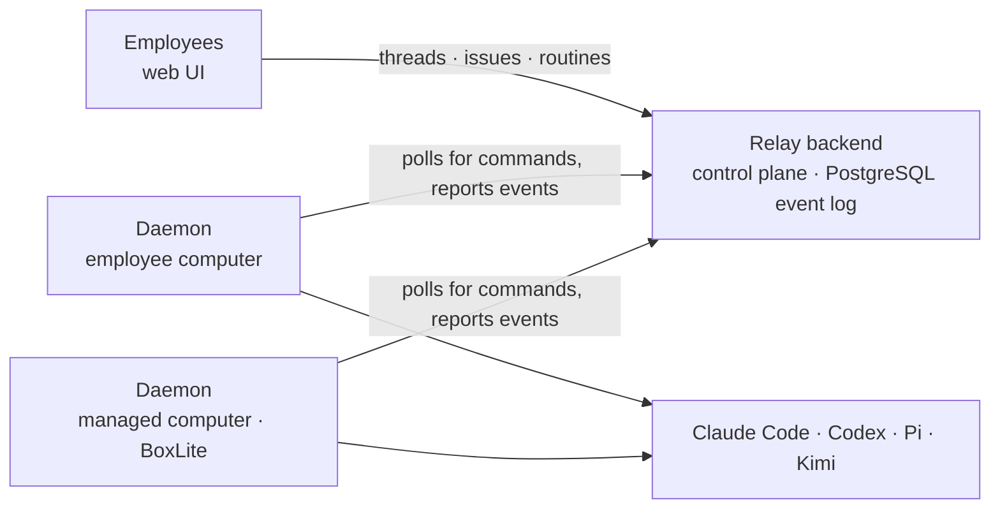

# Relay

<p align="center">
  
</p>

<p align="center"><strong>Every Employee. Amplified.</strong></p>

<p align="center">
  <a href="README.md">English</a> ·
  <a href="README.zh-CN.md">简体中文</a>
</p>

Relay is a local-first control plane for AI work. It gives every employee a bench of named AI agents — and the threads, issues, routines, and projects to direct them — while the organization keeps one record of who asked for what, which agent did it, on which computer, and what it produced.

Agents run where the work already lives. A Relay daemon on an employee's own computer, or on a managed computer, runs [Claude Code](https://github.com/anthropics/claude-code), Codex, Pi, and Kimi against a real workspace — directly on the host, or inside a [BoxLite](https://github.com/boxlite-ai/boxlite) sandbox. The backend never executes an agent: it queues work, records every event, and streams the result back to the web UI.

<p align="center">
  
</p>

## Why Relay

- **Named agents, not anonymous CLIs.** An agent has a name, a role, standing instructions, skills, and a home computer. Several agents can share one runtime, and every turn is attributed to the agent that ran it.
- **One place for ad-hoc and planned work.** Ask in a thread, track it as an issue, put it on a schedule as a routine, or give it a shared workspace as a project — all four dispatch through the same path.
- **Teams that review their own work.** Put agents on a team, choose how they collaborate — Solo, Build → Review, Pipeline, or Lead-led — and assign the team instead of a single agent.
- **People stay in charge.** Watch a run as it streams, stop it, retry it, hand it to another agent, and decide when the work is accepted. Decisions are recorded with the employee who made them.
- **Your computers, your credentials.** Daemons connect out to the backend, so agents use the tools and logins already on the machine, and nothing about a workspace has to leave it to be useful.
- **An organization-wide view.** Administrators see employees, computers, fleet health, activity, and token usage in one control panel.

## How it works


```mermaid
flowchart LR
  people["Employees<br/>web UI"]
  backend["Relay backend<br/>control plane · PostgreSQL event log"]
  local["Daemon<br/>employee computer"]
  managed["Daemon<br/>managed computer · BoxLite"]
  agents["Claude Code · Codex · Pi · Kimi"]

  people -->|"threads · issues · routines"| backend
  local -->|"polls for commands, reports events"| backend
  managed -->|"polls for commands, reports events"| backend
  local --> agents
  managed --> agents
```

The backend owns sessions, tasks, identity, and the computer registry. Each daemon registers with it, polls for commands, runs the agent CLI in its workspace, and reports output, results, and generated files back. See [System Architecture](docs/system-architecture.md) for the full picture.

## Features

| | |
|---|---|
| **Threads** | Start a thread with an agent, a team, or a project on the computer you choose. The agent decides whether the goal needs an answer, investigation, workspace changes, validation, review, or a clarifying question. Stream reasoning, commands, and tool calls; stop, retry, or hand the thread to another agent. |
| **Issues** | Capture work as issues with priority, due date, and an agent or team assignee. Triage them into projects, follow them from backlog to done, and read each issue's run history and produced files. |
| **Routines** | Schedule recurring work daily, weekly, or monthly. The scheduler promotes each due routine into a run and dispatches it to its assignee; pause a routine or run it now. |
| **Projects** | Bind a persistent shared workspace and an ordered roster of project agents to one computer, then run project threads and issues that share that workspace. |
| **Agents & teams** | Create named agents with a runtime, role, personality, and skills. Group them into teams with a lead, per-member responsibilities, acceptance criteria, and a collaboration style. |
| **Skills** | Publish reusable skill bundles, inspect their files and revisions, and grant them to individual agents or teams from a shared library. |
| **Computers** | Enroll employee computers or reconcile managed computers while tracking health, installed runtimes, capacity, command leases, and durable identity. |
| **Administration** | Operate employees, agents, computers, fleet health, activity, and token usage from one control panel. |

## Product tour

The snapshots below show the web UI with demo data. They are generated by [`script/readme-snapshots`](script/readme-snapshots/capture.mjs) and can be refreshed without a running backend.

### Work with agents in a thread

A thread runs on one computer and belongs to an agent, a team, or a project. Each turn streams as it happens — reasoning, commands, tool calls, and the files it produced. In the snapshot at the top of this page, one agent has fixed a race condition and handed it to a second agent, whose review is still running.

### Plan work as issues

One table holds every open issue across projects, with queues for what needs you, what is untriaged, blocked, running, or overdue. An issue can run once it sits in a project and has an agent or a team assigned.

<p align="center">
  
</p>

### Give work a shared workspace

A project binds a workspace directory and a roster of agents to one computer. Its board follows the project's issues from backlog to done, with flow numbers — work in progress, blocked, overdue, cycle time — above it.

<p align="center">
  
</p>

### Put recurring work on a schedule

Routines are issues that repeat. Each one names its cadence, its next run, and the agent or team that carries it out.

<p align="center">
  
</p>

### Shape each agent

An agent's record shows its runtime, the computer that hosts it, its availability, its role, and the personality applied before every run — next to the skills it has been granted and its recent activity.

<p align="center">
  
</p>

### Coordinate agent teams

A team lives on one computer and states who does what: the lead, each member's role and responsibility, and how a round of work moves between them.

<p align="center">
  
</p>

### Share skills across agents

Skills are versioned bundles of instructions, references, and scripts. Publish one to the organization, review its files and revision history, and grant it to the agents that need it.

<p align="center">
  
</p>

### See what each computer is doing

Every enrolled computer reports what it is running now, which agent runtimes are installed and ready, and where its workspace lives. A local computer runs agents directly; a managed one runs them inside BoxLite.

<p align="center">
  
</p>

### Run the organization

The control panel's dashboard tracks thread volume, fleet health, token usage, and the most active employees.

<p align="center">
  
</p>

## Quick start

Prerequisites: Node.js 22.19+, npm, Python 3.12+, [uv](https://docs.astral.sh/uv/), PostgreSQL, credentials for the agent CLIs you want to run, and — for the daemon's default BoxLite sandbox — Docker with hardware virtualization.

```bash
npm install
npm run build
```

Copy the environment examples and add your agent credentials (details in [Local Development](docs/local-development.md)):

```bash
cp backend/.env.example backend/.env
cp web/.env.example web/.env.local
cp packages/.env.example packages/.env
```

Sessions, tasks, events, and artifacts always live in PostgreSQL. Create the database that `RELAY_DATABASE_URL` in `backend/.env` names — the example expects role `relay` and database `relay` on `localhost:5432` — then apply the schema:

```bash
make backend-migrate
```

Create the first admin account (there is no default password):

```bash
script/init_users.sh --password 'choose-a-strong-password'
```

Start each service in its own terminal:

```bash
make backend                     # control plane on 127.0.0.1:8790
make daemon SANDBOX_ID=node_dev  # execution node connected to the backend
make web                         # web UI on 127.0.0.1:5000
```

Open <http://127.0.0.1:5000> and sign in as `admin`.

Tests, database migrations, the supervisor, pre-commit hooks, and shutdown commands are covered in [Local Development](docs/local-development.md).

## Project structure

Relay is one repository with a Python control plane, TypeScript execution packages, and a Next.js web UI. The backend never runs an agent; everything that executes lives under `packages/`.

```
backend/                  Python / FastAPI control plane
  relay/api/              HTTP routes, one module per domain (threads, tasks, agents, teams, projects, admin …)
  relay/persistence/      Event-sourced stores for sessions, tasks, agents, teams, and projects
  relay/sessions/         Session controller, handoff, and conversation continuity
  relay/daemon_registry/  Computer admission, command leases, run dispatch
  relay/tasks/            Scheduler that promotes routines and dispatches assigned issues
  relay/services/         Assignment, workspaces, team and project runtime rules
  relay/security/         Auth store, JWT, password policy, rate limiting
  migrations/             Alembic migrations
  tests/                  pytest suite
packages/                 TypeScript (npm workspaces)
  relay-core/             Shared protocol and pure helpers: agent registry, CLI commands, prompts, renderers
  relay-daemon/           Execution plane: registers a computer, polls for commands, runs agent CLIs
  relay-supervisor/       Keeps employee daemons provisioned and running
web/                      Next.js web UI, exported statically and served by the backend
  src/components/         Pages and UI, grouped by surface
  src/lib/                Routing, derivations, and other pure helpers
  src/i18n/               English, Simplified Chinese, and Traditional Chinese strings
  tests/, e2e/            Unit tests and Playwright specs
docs/                     Architecture, API, deployment, design system, and ADRs (docs/adr)
script/                   User bootstrap, demo seeding, README snapshot generator
devbox/, dockerfile       The BoxLite guest image that sandboxed agents run in
```

| To change… | Start in |
|---|---|
| An API route or its response shape | `backend/relay/api/`, then `web/src/api.ts` and `web/src/types.ts` |
| How session or task state evolves | `backend/relay/persistence/` — state changes go through `append_event`, never a direct write |
| What a daemon and the backend say to each other | `packages/relay-core/src/daemon-node-protocol.ts` and `backend/relay/daemon_registry/` |
| How an agent CLI is launched or its output parsed | `packages/relay-core/src/agents.ts`, `commands.ts`, and `web/src/lib/agentStream.ts` |
| A page in the web UI | `web/src/components/`, with its strings in `web/src/i18n/locales/` |
| A database column | A new Alembic migration in `backend/migrations/` |

## Contributing

1. Follow the [quick start](#quick-start) to get the backend, a daemon, and the web UI running locally.
2. Read [`CLAUDE.md`](CLAUDE.md) before a larger change — it lists the invariants the codebase depends on, such as "the backend never executes agents" and "the event log is authoritative".
3. Run the checks that cover what you touched:

   ```bash
   npm test                   # TypeScript suite and Python backend suite
   make backend-test          # backend only
   npm run test:react -w web  # web component tests
   make pre-commit-run        # the hooks that run on every commit
   ```

4. Keep the documentation in step: update the matching page under [`docs/`](docs/README.md), and regenerate the README snapshots with `node script/readme-snapshots/capture.mjs` when a change alters a surface they show.

Design decisions are recorded as ADRs in [`docs/adr/`](docs/adr/README.md); add one when a change settles a question others will ask again.

## Deployment

[`docs/deployment.md`](docs/deployment.md) covers hosting the web UI on Vercel and the backend plus Postgres on Railway. Daemons stay off both platforms — they run wherever the sandbox lives and connect out to the backend URL.

## Documentation

Start with the [`docs/` index](docs/README.md) for the canonical setup, API, architecture, design, and decision documents.

## License

[AGPL-3.0-only](LICENSE)
