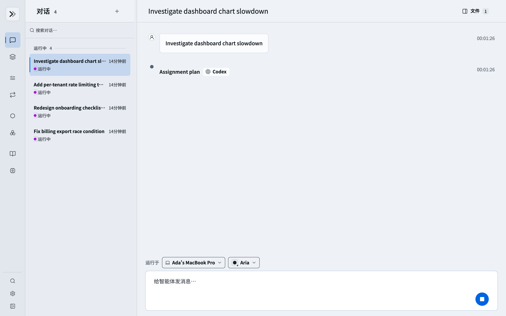
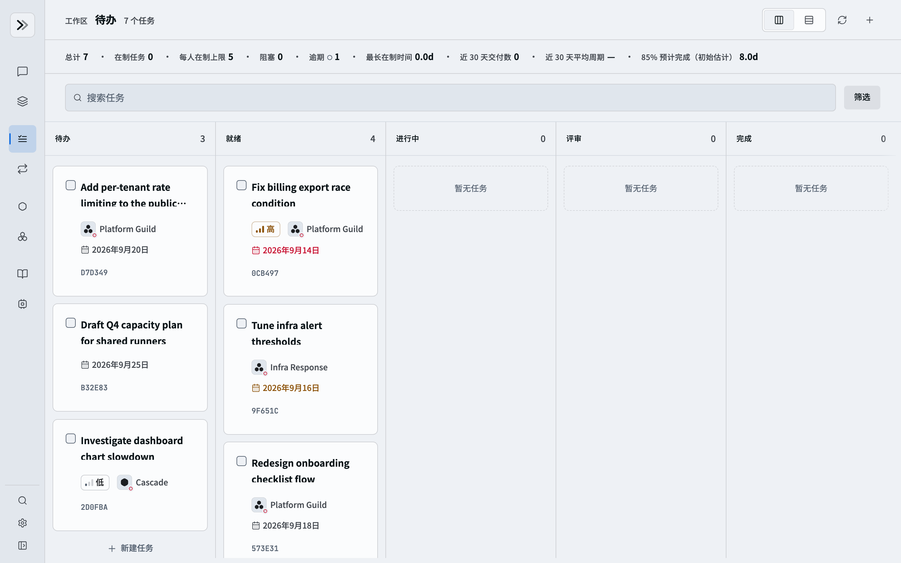
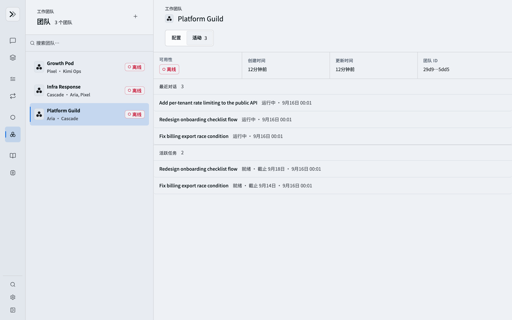

# Relay

[English](README.md) | [简体中文](README.zh-CN.md)

<p align="center">
  
</p>

<p align="center"><strong>让每一位员工，能力倍增。</strong></p>

Relay 是一个本地优先的 AI 工作控制平面。员工可以在一个界面中发起对话、分配持久任务、安排例行任务，并协调具名 AI 智能体与团队。

Relay 记录身份、审批、任务和历史，并跟踪每个智能体运行于哪台计算机。

Relay 守护进程在本地或托管计算机上，通过 BoxLite 沙箱或配置好的本地环境运行 Claude Code、Codex、Pi 和 Kimi。

## 功能特性

- **对话**：发起对话时明确选择智能体和计算机；智能体自行判断目标需要直接回答、调查、修改工作区、验证、评审还是澄清问题。流式查看工具输出，审批决策，取消或重试工作，并将对话移交给其他智能体。
- **任务与例行任务**：在待办中规划工作、安排周期性例行任务、分配智能体或团队、设置截止日期，并查看派发及事件历史。
- **智能体与团队**：创建具名智能体和团队，管理其资料、计算机部署、工作区文件、生成产物和近期活动。
- **项目**：将持久共享工作区和有序的项目智能体名册绑定到一台计算机，并运行共享该工作区的项目对话。
- **技能**：发布可复用的技能包，查看其中的文件与版本，并通过共享技能库将技能授予单个智能体或团队。
- **计算机**：注册员工计算机或协调托管计算机，同时跟踪健康状态、容量、命令租约和持久身份。
- **聊天网关**：通过统一聊天网关连接 Discord、Telegram 和 Lark，将外部身份与会话映射到 Relay。
- **管理**：在管理区域统一管理员工、智能体、计算机、集群健康、活动和令牌用量。

## 产品截图

### 发起并引导对话

选择工作在哪台计算机运行、由哪个具名智能体处理；Relay 将目标交给所选参与者，由每个智能体自行选择合适的执行路径。

<p align="center">
  
</p>

### 规划并派发工作

待办视图集中展示优先级、分配对象、截止日期、状态和派发上下文。

<p align="center">
  
</p>

### 协调智能体团队

团队工作区将该团队的活跃运行、最近对话和进行中的任务集中在一个视图。

<p align="center">
  
</p>

## 快速开始

前置条件：Node.js 22.19+、npm、Python 3.12+、[uv](https://docs.astral.sh/uv/)、PostgreSQL、所需智能体 CLI 的凭据，以及（守护进程默认的 BoxLite 沙箱所需）支持硬件虚拟化的 Docker。

```bash
npm install
npm run build
```

复制环境变量示例文件并填入智能体凭据（详见[本地开发指南](docs/local-development.md)）：

```bash
cp backend/.env.example backend/.env
cp web/.env.example web/.env.local
cp packages/.env.example packages/.env
```

会话、任务、事件与产物始终存储在 PostgreSQL 中。请先创建 `backend/.env` 中 `RELAY_DATABASE_URL` 指向的数据库——示例配置期望 `localhost:5432` 上存在角色 `relay` 与数据库 `relay`——然后应用数据库结构：

```bash
make backend-migrate
```

创建第一个管理员账户（没有默认密码）：

```bash
script/init_users.sh --password 'choose-a-strong-password'
```

在不同终端中分别启动服务：

```bash
make backend                     # 控制平面，监听 127.0.0.1:8790
make daemon SANDBOX_ID=node_dev  # 连接后端的执行节点
make web                         # Web 界面，监听 127.0.0.1:5000
```

打开 <http://127.0.0.1:5000>，以 `admin` 身份登录。

测试、数据库迁移、协调器、pre-commit 钩子和停止命令请参阅[本地开发指南](docs/local-development.md)。

## 部署

[`docs/deployment.md`](docs/deployment.md) 介绍如何将 Web 界面部署到 Vercel、将后端和 Postgres 部署到 Railway。守护进程不部署在这两个平台上——它们运行在沙箱所在的计算机上，并主动连接后端 URL。

## 文档

从 [`docs/` 中文索引](docs/README.zh-CN.md)开始，查找环境搭建、API、架构、聊天集成、设计和决策的权威文档。

## 许可证

[MIT](LICENSE)
