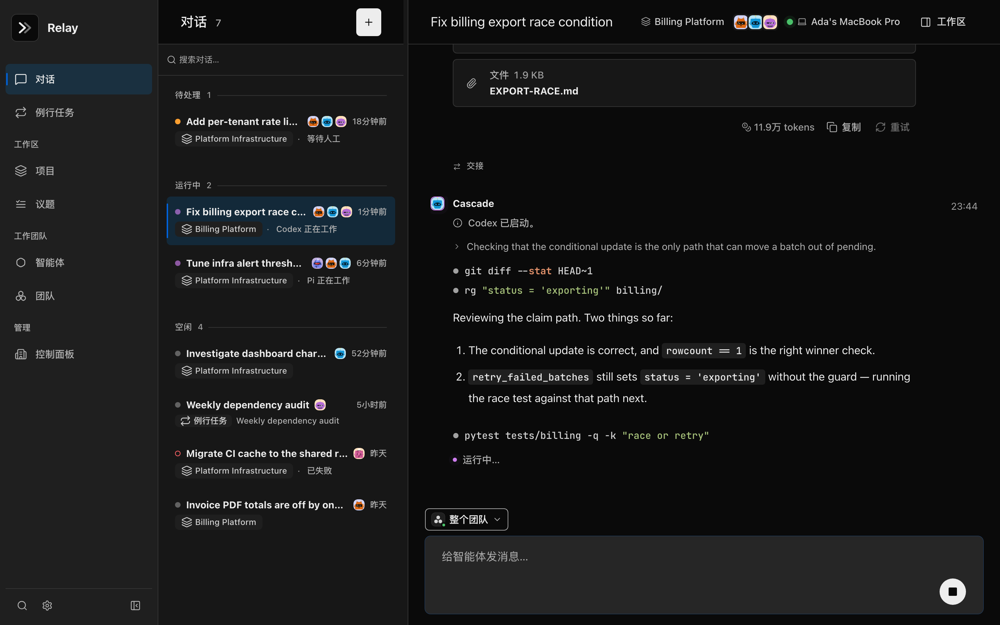
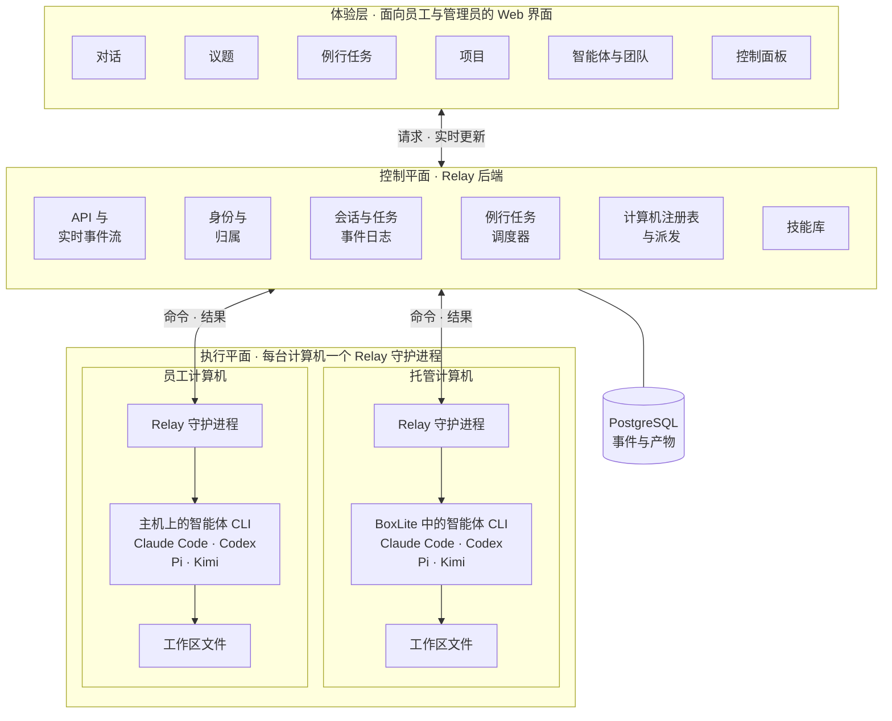
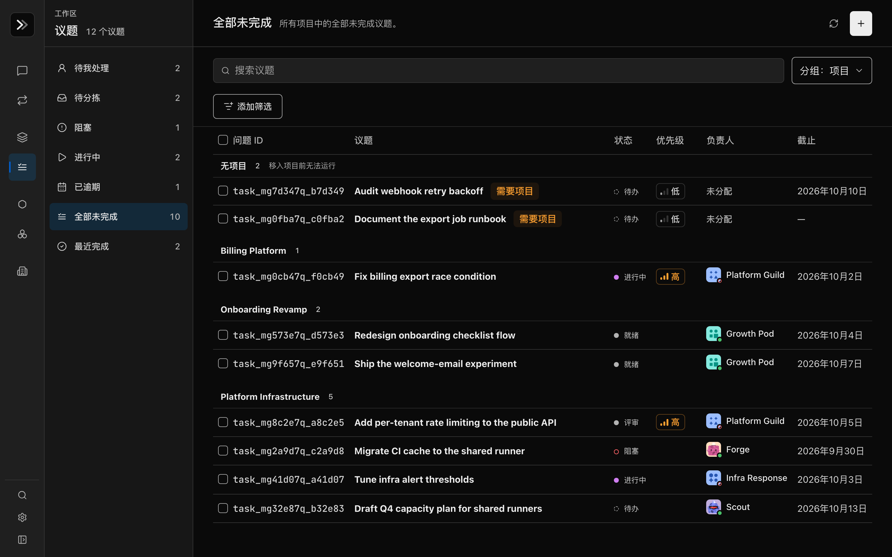
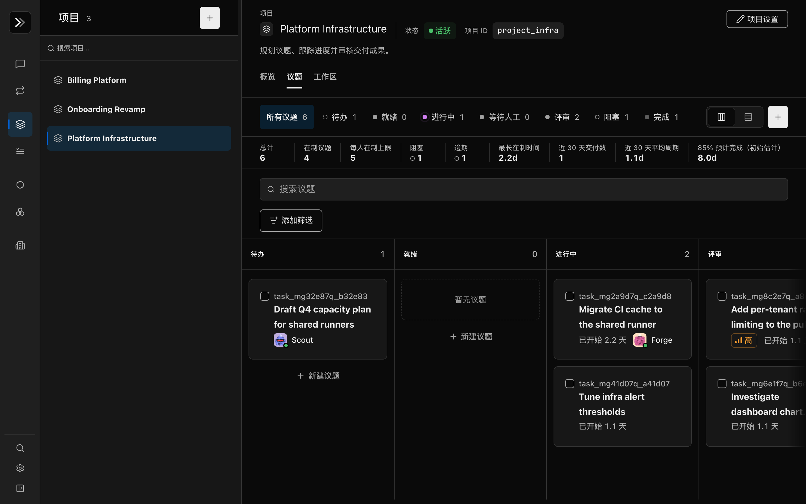
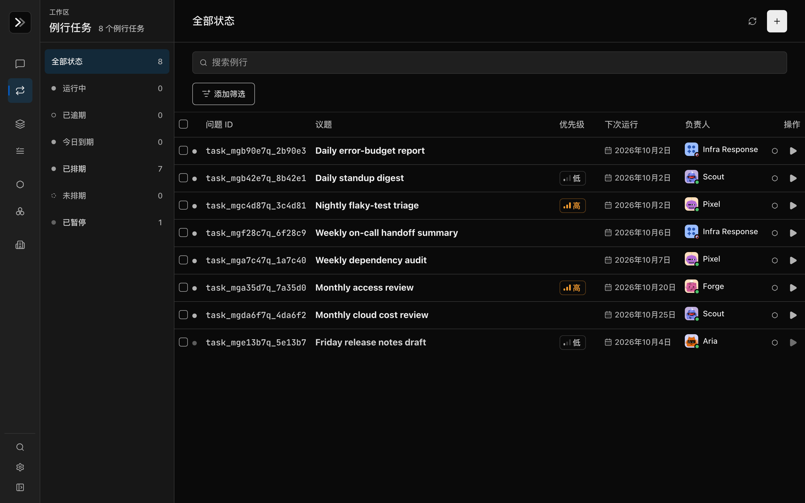
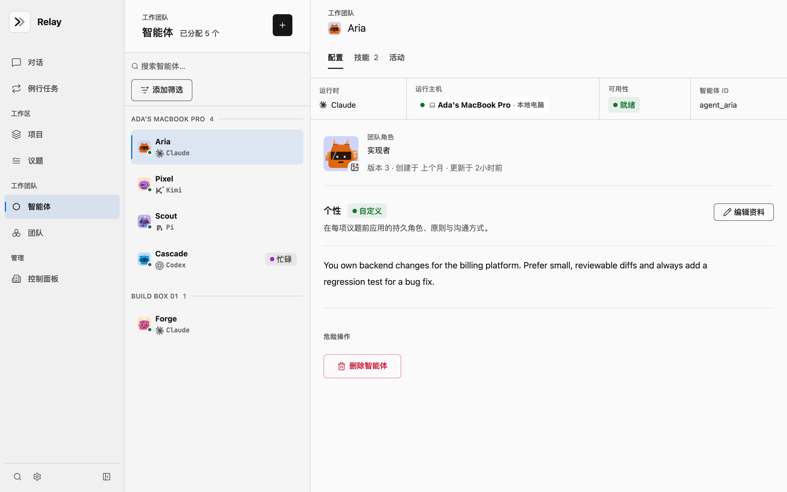
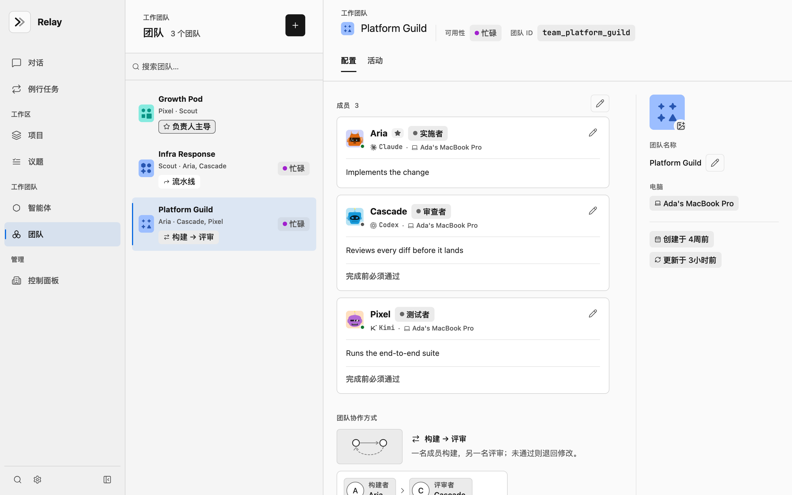
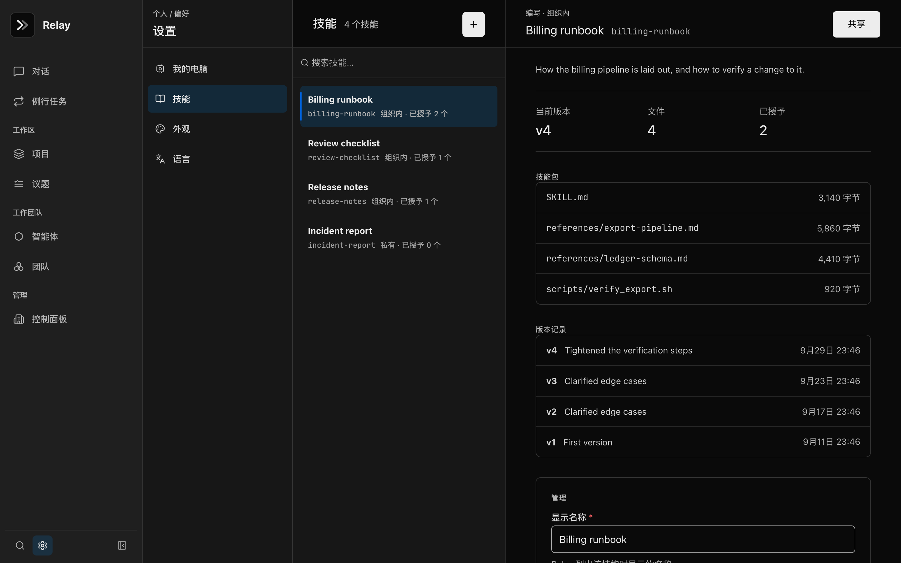
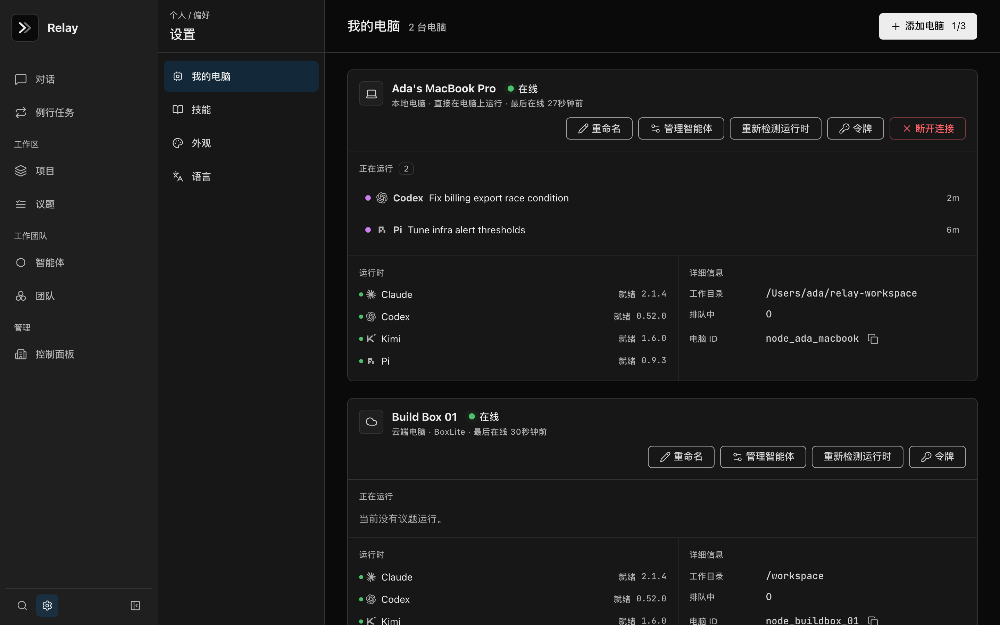
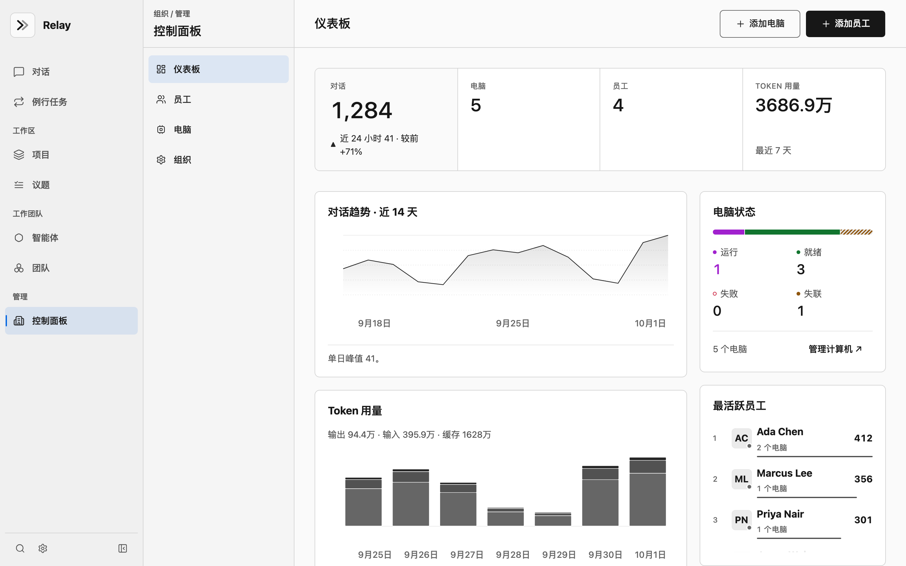

# Relay

[English](README.md) | [简体中文](README.zh-CN.md)

<p align="center">
  
</p>

<p align="center"><strong>让每一位员工，能力倍增。</strong></p>

Relay 是一个本地优先的 AI 工作控制平面。员工通过对话、议题、例行任务和项目来指挥具名 AI 智能体，组织则保有一份统一记录：谁提出了什么需求、由哪个智能体完成、在哪台计算机上运行、产出了什么。

智能体在工作所在之处运行。部署在员工计算机或托管计算机上的 Relay 守护进程，会在真实工作区中运行 [Claude Code](https://github.com/anthropics/claude-code)、Codex、Pi 和 Kimi——直接在主机上，或在 [BoxLite](https://github.com/boxlite-ai/boxlite) 沙箱中。

<p align="center">
  
</p>

## 功能特性

- **对话** — 在你选择的计算机上与智能体、团队或项目协作。实时查看推理、命令和工具调用；随时停止、重试或交接。
- **议题** — 以优先级、截止日期和智能体或团队负责人来跟踪工作，从待办到完成，并保留运行历史和产出文件。
- **例行任务** — 按每日、每周或每月安排周期性工作；Relay 会将每次运行派发给负责人。
- **项目** — 将共享工作区和智能体名册绑定到一台计算机。
- **智能体与团队** — 为每个智能体配置运行时、角色、个性和技能。将智能体组成团队，协作方式可选单人、构建 → 评审、流水线或负责人主导。
- **技能** — 发布带版本的技能包，并通过共享技能库授予智能体。
- **计算机** — 注册员工计算机或托管计算机，查看其健康状态、运行时和正在运行的工作。
- **管理** — 在同一个控制面板中管理员工、计算机、活动和令牌用量。

## 产品架构

Relay 分为三层：人在 Web 界面中工作，后端负责决策与记录，运行在真实计算机上的守护进程负责执行。


```mermaid
flowchart TB
  subgraph experience["体验层 · 面向员工与管理员的 Web 界面"]
    direction TB
    threads["对话"]
    issues["议题"]
    routines["例行任务"]
    projects["项目"]
    workforce["智能体与团队"]
    admin["控制面板"]
  end

  subgraph control["控制平面 · Relay 后端"]
    direction TB
    api["API 与<br/>实时事件流"]
    identity["身份与<br/>归属"]
    records["会话与任务<br/>事件日志"]
    scheduler["例行任务<br/>调度器"]
    registry["计算机注册表<br/>与派发"]
    skills["技能库"]
  end

  store[("PostgreSQL<br/>事件与产物")]

  subgraph execution["执行平面 · 每台计算机一个 Relay 守护进程"]
    direction TB
    subgraph managed["托管计算机"]
      managedDaemon["Relay 守护进程"]
      managedAgents["BoxLite 中的智能体 CLI<br/>Claude Code · Codex<br/>Pi · Kimi"]
      managedWorkspace["工作区文件"]
      managedDaemon --> managedAgents --> managedWorkspace
    end
    subgraph local["员工计算机"]
      localDaemon["Relay 守护进程"]
      localAgents["主机上的智能体 CLI<br/>Claude Code · Codex<br/>Pi · Kimi"]
      localWorkspace["工作区文件"]
      localDaemon --> localAgents --> localWorkspace
    end
  end

  experience <-->|"请求 · 实时更新"| control
  control <-->|"命令 · 结果"| localDaemon
  control <-->|"命令 · 结果"| managedDaemon
  control --- store
```

后端从不执行智能体。它将每一次状态变更写入 PostgreSQL 中的事件日志并派发运行；每个守护进程主动连接后端、轮询命令、在自己的工作区中运行智能体 CLI，并回传结果。详见[系统架构](docs/system-architecture.md)。

## 产品导览

<table>
  <tr>
    <td width="50%" valign="top">
      
      <br><strong>议题</strong><br>汇总所有项目中未完成的议题，并按待处理队列分类。
    </td>
    <td width="50%" valign="top">
      
      <br><strong>项目</strong><br>从待办到完成的项目看板，附流动指标。
    </td>
  </tr>
  <tr>
    <td width="50%" valign="top">
      
      <br><strong>例行任务</strong><br>周期性工作及其执行频率、下次运行时间和负责人。
    </td>
    <td width="50%" valign="top">
      
      <br><strong>智能体</strong><br>运行时、所在计算机、角色、个性和技能。
    </td>
  </tr>
  <tr>
    <td width="50%" valign="top">
      
      <br><strong>团队</strong><br>成员、职责，以及工作如何在成员之间流转。
    </td>
    <td width="50%" valign="top">
      
      <br><strong>技能</strong><br>带版本的技能包及其文件和修订历史。
    </td>
  </tr>
  <tr>
    <td width="50%" valign="top">
      
      <br><strong>计算机</strong><br>每台计算机正在运行的工作和已就绪的运行时。
    </td>
    <td width="50%" valign="top">
      
      <br><strong>控制面板</strong><br>对话数量、集群健康和令牌用量。
    </td>
  </tr>
</table>

截图使用演示数据，由 [`script/readme-snapshots`](script/readme-snapshots/capture.mjs) 生成。

## 快速开始

前置条件：Node.js 22.19+、npm、Python 3.12+、[uv](https://docs.astral.sh/uv/)、PostgreSQL、所需智能体 CLI 的凭据，以及（守护进程默认的 BoxLite 沙箱所需）支持硬件虚拟化的 Docker。

```bash
npm install
npm run build
```

复制环境变量示例文件并填入智能体凭据（详见[本地开发指南](docs/local-development.md)）：

```bash
cp backend/.env.example backend/.env
cp web/.env.example web/.env.local
cp packages/.env.example packages/.env
```

会话、任务、事件与产物始终存储在 PostgreSQL 中。请先创建 `backend/.env` 中 `RELAY_DATABASE_URL` 指向的数据库——示例配置期望 `localhost:5432` 上存在角色 `relay` 与数据库 `relay`——然后应用数据库结构：

```bash
make backend-migrate
```

创建第一个管理员账户（没有默认密码）：

```bash
script/init_users.sh --password 'choose-a-strong-password'
```

在不同终端中分别启动服务：

```bash
make backend                     # 控制平面，监听 127.0.0.1:8790
make daemon SANDBOX_ID=node_dev  # 连接后端的执行节点
make web                         # Web 界面，监听 127.0.0.1:5000
```

打开 <http://127.0.0.1:5000>，以 `admin` 身份登录。

测试、数据库迁移、协调器、pre-commit 钩子和停止命令请参阅[本地开发指南](docs/local-development.md)。

## 项目结构

```
backend/     Python / FastAPI 控制平面：API 路由、事件溯源存储、调度器、数据库迁移
packages/    TypeScript 工作区
  relay-core/        共享协议、智能体注册表、CLI 命令、提示词
  relay-daemon/      执行平面：注册计算机并运行智能体 CLI
  relay-supervisor/  确保员工守护进程已部署并保持运行
web/         Next.js Web 界面，静态导出后由后端提供服务
docs/        架构、API、部署、设计系统文档及 ADR
script/      用户初始化、演示数据、README 截图生成脚本
devbox/      沙箱内智能体所运行的 BoxLite 客户机镜像
```

## 参与贡献

1. 按照[快速开始](#快速开始)在本地运行整套服务。
2. 阅读 [`CLAUDE.md`](CLAUDE.md) 了解代码库依赖的不变式，并在 [`docs/adr/`](docs/adr/README.md) 中查阅过往的设计决策。
3. 提交 Pull Request 前运行 `npm test`（TypeScript 与 Python 测试）和 `make pre-commit-run`。
4. 行为发生变化时，同步更新 [`docs/`](docs/README.zh-CN.md) 下对应的页面。

详细的目录结构以及各类改动的入手位置，见 [`CONTRIBUTING.md`](CONTRIBUTING.md)（英文）。

## 部署

[`docs/deployment.md`](docs/deployment.md) 介绍如何将 Web 界面部署到 Vercel、将后端和 Postgres 部署到 Railway。守护进程不部署在这两个平台上——它们运行在沙箱所在的计算机上，并主动连接后端 URL。

## 文档

从 [`docs/` 中文索引](docs/README.zh-CN.md)开始，查找环境搭建、API、架构、设计和决策的权威文档。

## 许可证

[MIT](LICENSE)
