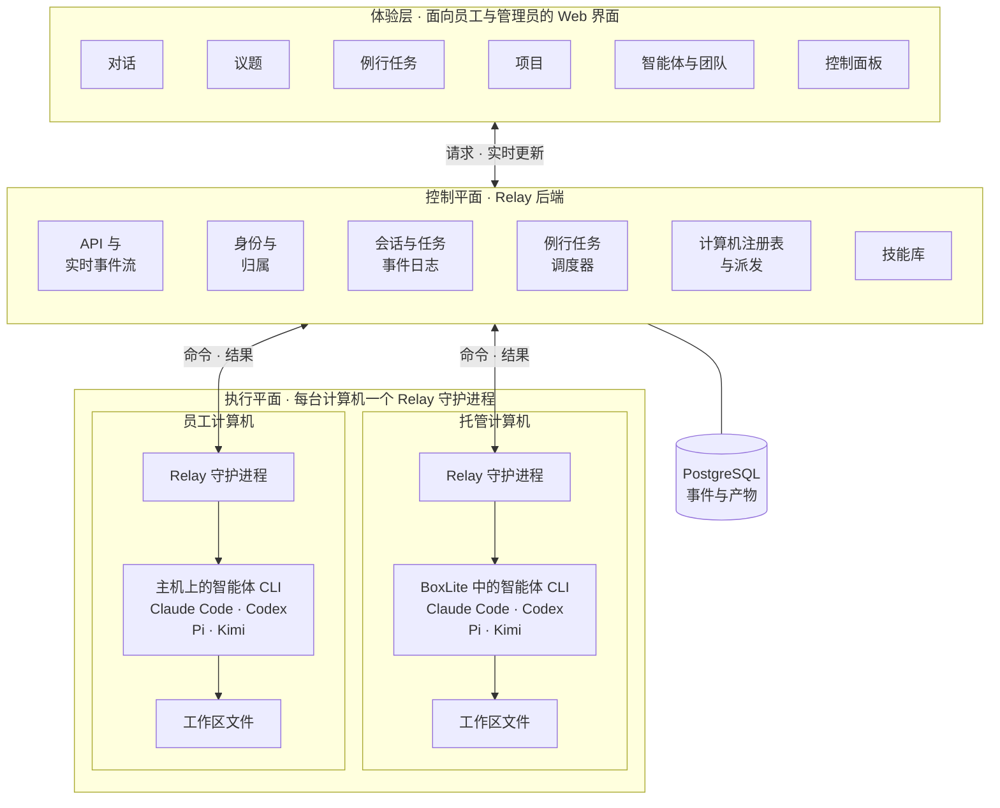

# Relay

[English](README.md) | [简体中文](README.zh-CN.md)

<p align="center">
  
</p>

<p align="center"><strong>让每一位员工，能力倍增。</strong></p>

Relay 是一个本地优先的 AI 工作控制平面。它为每位员工配备一组具名 AI 智能体，以及指挥它们所需的对话、议题、例行任务和项目；同时让组织保有一份统一记录：谁提出了什么需求、由哪个智能体完成、在哪台计算机上运行、产出了什么。

智能体在工作所在之处运行。部署在员工自己的计算机或托管计算机上的 Relay 守护进程，会直接在主机上或在 [BoxLite](https://github.com/boxlite-ai/boxlite) 沙箱中，针对真实工作区运行 [Claude Code](https://github.com/anthropics/claude-code)、Codex、Pi 和 Kimi。后端从不执行智能体：它只负责排队派发、记录每一个事件，并将结果流式推送到 Web 界面。

<p align="center">
  
</p>

## 为什么选择 Relay

- **具名智能体，而非匿名命令行。** 每个智能体都有名称、角色、常驻指令、技能和所在计算机。多个智能体可以共用同一种运行时，每一轮输出都归属到实际执行它的智能体。
- **临时工作与计划工作，一处搞定。** 在对话中直接提问，作为议题跟踪，作为例行任务定期执行，或作为项目提供共享工作区——四种方式都走同一条派发路径。
- **会自我评审的团队。** 将智能体编入团队，选择协作方式——单人、构建 → 评审、流水线或负责人主导——然后把工作分配给团队而不是单个智能体。
- **人始终掌握主导权。** 实时查看运行输出，随时停止、重试或交接给其他智能体，并由人决定工作何时算完成。每项决策都会连同做出决策的员工一并记录。
- **你的计算机，你的凭据。** 守护进程主动连接后端，智能体直接使用机器上已有的工具和登录状态，工作区无需离开本机即可发挥作用。
- **组织级全局视图。** 管理员可在同一个控制面板中查看员工、计算机、集群健康、活动和令牌用量。

## 产品架构

Relay 分为三层：人在 Web 界面中工作，后端负责决策与记录，运行在真实计算机上的守护进程负责执行。


```mermaid
flowchart TB
  subgraph experience["体验层 · 面向员工与管理员的 Web 界面"]
    direction TB
    threads["对话"]
    issues["议题"]
    routines["例行任务"]
    projects["项目"]
    workforce["智能体与团队"]
    admin["控制面板"]
  end

  subgraph control["控制平面 · Relay 后端"]
    direction TB
    api["API 与<br/>实时事件流"]
    identity["身份与<br/>归属"]
    records["会话与任务<br/>事件日志"]
    scheduler["例行任务<br/>调度器"]
    registry["计算机注册表<br/>与派发"]
    skills["技能库"]
  end

  store[("PostgreSQL<br/>事件与产物")]

  subgraph execution["执行平面 · 每台计算机一个 Relay 守护进程"]
    direction TB
    subgraph managed["托管计算机"]
      managedDaemon["Relay 守护进程"]
      managedAgents["BoxLite 中的智能体 CLI<br/>Claude Code · Codex<br/>Pi · Kimi"]
      managedWorkspace["工作区文件"]
      managedDaemon --> managedAgents --> managedWorkspace
    end
    subgraph local["员工计算机"]
      localDaemon["Relay 守护进程"]
      localAgents["主机上的智能体 CLI<br/>Claude Code · Codex<br/>Pi · Kimi"]
      localWorkspace["工作区文件"]
      localDaemon --> localAgents --> localWorkspace
    end
  end

  experience <-->|"请求 · 实时更新"| control
  control <-->|"命令 · 结果"| localDaemon
  control <-->|"命令 · 结果"| managedDaemon
  control --- store
```

- **体验层。** 面向员工与管理员的统一 Web 界面：用对话、议题、例行任务和项目来指挥工作；用智能体与团队来决定由谁完成；用控制面板来运营整个组织。
- **控制平面。** 后端负责身份、会话、任务、技能和计算机注册表，并将每一次状态变更写入 PostgreSQL 中的事件日志。它调度例行任务并派发运行，但自身从不执行智能体。
- **执行平面。** 每台计算机运行一个守护进程。它主动连接后端、轮询命令、在自己的工作区中运行智能体 CLI——员工计算机直接在主机上运行，托管计算机在 BoxLite 中运行——并回传输出、结果和生成的文件。

完整说明见[系统架构](docs/system-architecture.md)。

## 功能特性

| | |
|---|---|
| **对话** | 在你选择的计算机上，与智能体、团队或项目发起对话。智能体自行判断目标需要直接回答、调查、修改工作区、验证、评审还是澄清问题。流式查看推理、命令和工具调用；随时停止、重试，或将对话交接给其他智能体。 |
| **议题** | 将工作记录为议题，设置优先级、截止日期，并分配给智能体或团队。把议题分拣到项目中，跟踪其从待办到完成的全过程，并查看每个议题的运行历史和产出文件。 |
| **例行任务** | 按每日、每周或每月安排周期性工作。调度器会将到期的例行任务转为一次运行并派发给负责人；可以暂停，也可以立即运行。 |
| **项目** | 将持久共享工作区和有序的项目智能体名册绑定到一台计算机，并运行共享该工作区的项目对话与议题。 |
| **智能体与团队** | 创建具名智能体，配置运行时、角色、个性和技能。将它们组成团队，设置负责人、成员职责、验收标准和协作方式。 |
| **技能** | 发布可复用的技能包，查看其中的文件与修订版本，并通过共享技能库将技能授予单个智能体或团队。 |
| **计算机** | 注册员工计算机或协调托管计算机，同时跟踪健康状态、已安装的运行时、容量、命令租约和持久身份。 |
| **管理** | 在同一个控制面板中管理员工、智能体、计算机、集群健康、活动和令牌用量。 |

## 产品导览

以下截图展示的是使用演示数据的 Web 界面，由 [`script/readme-snapshots`](script/readme-snapshots/capture.mjs) 生成，无需运行后端即可刷新。

### 在对话中与智能体协作

一个对话运行在一台计算机上，归属于某个智能体、团队或项目。每一轮都会实时输出——推理、命令、工具调用以及产出的文件。在本页顶部的截图中，一个智能体修复了竞态条件并交接给第二个智能体，后者的评审仍在进行。

### 用议题规划工作

一张表汇总所有项目中未完成的议题，并按"待我处理、待分拣、阻塞、进行中、已逾期"分队列展示。议题进入项目并分配给智能体或团队后即可运行。

<p align="center">
  
</p>

### 为工作提供共享工作区

项目将一个工作区目录和一份智能体名册绑定到一台计算机。项目看板跟踪议题从待办到完成的流转，上方展示流动指标——在制数量、阻塞、逾期和周期时间。

<p align="center">
  
</p>

### 让周期性工作按计划运行

例行任务是会重复执行的议题。每个例行任务都标明执行频率、下次运行时间，以及负责执行的智能体或团队。

<p align="center">
  
</p>

### 塑造每个智能体

智能体档案展示其运行时、所在计算机、可用状态、角色，以及每次运行前应用的个性设定——旁边是已授予的技能和近期活动。

<p align="center">
  
</p>

### 协调智能体团队

团队部署在一台计算机上，并明确分工：谁是负责人、每位成员的角色与职责，以及一轮工作如何在成员之间流转。

<p align="center">
  
</p>

### 在智能体之间共享技能

技能是带版本的指令、参考资料和脚本包。将技能发布到组织，查看其文件和修订历史，并授予需要它的智能体。

<p align="center">
  
</p>

### 了解每台计算机在做什么

每台已注册的计算机都会报告当前正在运行的工作、已安装并就绪的智能体运行时，以及工作区位置。本地计算机直接运行智能体；托管计算机则在 BoxLite 中运行。

<p align="center">
  
</p>

### 运营整个组织

控制面板的仪表板跟踪对话数量、集群健康、令牌用量和最活跃的员工。

<p align="center">
  
</p>

## 快速开始

前置条件：Node.js 22.19+、npm、Python 3.12+、[uv](https://docs.astral.sh/uv/)、PostgreSQL、所需智能体 CLI 的凭据，以及（守护进程默认的 BoxLite 沙箱所需）支持硬件虚拟化的 Docker。

```bash
npm install
npm run build
```

复制环境变量示例文件并填入智能体凭据（详见[本地开发指南](docs/local-development.md)）：

```bash
cp backend/.env.example backend/.env
cp web/.env.example web/.env.local
cp packages/.env.example packages/.env
```

会话、任务、事件与产物始终存储在 PostgreSQL 中。请先创建 `backend/.env` 中 `RELAY_DATABASE_URL` 指向的数据库——示例配置期望 `localhost:5432` 上存在角色 `relay` 与数据库 `relay`——然后应用数据库结构：

```bash
make backend-migrate
```

创建第一个管理员账户（没有默认密码）：

```bash
script/init_users.sh --password 'choose-a-strong-password'
```

在不同终端中分别启动服务：

```bash
make backend                     # 控制平面，监听 127.0.0.1:8790
make daemon SANDBOX_ID=node_dev  # 连接后端的执行节点
make web                         # Web 界面，监听 127.0.0.1:5000
```

打开 <http://127.0.0.1:5000>，以 `admin` 身份登录。

测试、数据库迁移、协调器、pre-commit 钩子和停止命令请参阅[本地开发指南](docs/local-development.md)。

## 项目结构

Relay 是一个单一仓库，包含 Python 控制平面、TypeScript 执行层软件包和 Next.js Web 界面。后端从不运行智能体；所有执行相关的代码都在 `packages/` 下。

```
backend/                  Python / FastAPI 控制平面
  relay/api/              HTTP 路由，按领域拆分（对话、任务、智能体、团队、项目、管理……）
  relay/persistence/      会话、任务、智能体、团队、项目的事件溯源存储
  relay/sessions/         会话控制器、交接与对话连续性
  relay/daemon_registry/  计算机准入、命令租约、运行派发
  relay/tasks/            调度器：触发例行任务并派发已分配的议题
  relay/services/         分配、工作区、团队与项目运行时规则
  relay/security/         认证存储、JWT、密码策略、限流
  migrations/             Alembic 数据库迁移
  tests/                  pytest 测试
packages/                 TypeScript（npm workspaces）
  relay-core/             共享协议与纯函数：智能体注册表、CLI 命令、提示词、渲染器
  relay-daemon/           执行平面：注册计算机、轮询命令、运行智能体 CLI
  relay-supervisor/       确保员工守护进程已部署并保持运行
web/                      Next.js Web 界面，静态导出后由后端提供服务
  src/components/         页面与 UI，按功能界面组织
  src/lib/                路由、派生逻辑及其他纯函数
  src/i18n/               英文、简体中文、繁体中文文案
  tests/, e2e/            单元测试与 Playwright 用例
docs/                     架构、API、部署、设计系统文档及 ADR（docs/adr）
script/                   用户初始化、演示数据、README 截图生成脚本
devbox/, dockerfile       沙箱内智能体所运行的 BoxLite 客户机镜像
```

| 想要修改…… | 从这里开始 |
|---|---|
| API 路由或其响应结构 | `backend/relay/api/`，然后是 `web/src/api.ts` 与 `web/src/types.ts` |
| 会话或任务状态的演变方式 | `backend/relay/persistence/`——状态变更必须经过 `append_event`，不可直接写入 |
| 守护进程与后端之间的通信协议 | `packages/relay-core/src/daemon-node-protocol.ts` 与 `backend/relay/daemon_registry/` |
| 智能体 CLI 的启动方式或输出解析 | `packages/relay-core/src/agents.ts`、`commands.ts` 以及 `web/src/lib/agentStream.ts` |
| Web 界面中的某个页面 | `web/src/components/`，文案位于 `web/src/i18n/locales/` |
| 数据库字段 | 在 `backend/migrations/` 中新增 Alembic 迁移 |

## 参与贡献

1. 按照[快速开始](#快速开始)在本地运行后端、守护进程和 Web 界面。
2. 进行较大改动前先阅读 [`CLAUDE.md`](CLAUDE.md)——其中列出了代码库依赖的不变式，例如"后端从不执行智能体"和"事件日志是唯一权威"。
3. 运行与改动相关的检查：

   ```bash
   npm test                   # TypeScript 测试与 Python 后端测试
   make backend-test          # 仅后端
   npm run test:react -w web  # Web 组件测试
   make pre-commit-run        # 每次提交时运行的钩子
   ```

4. 同步更新文档：修改 [`docs/`](docs/README.zh-CN.md) 下对应的页面；如果改动影响了 README 截图展示的界面，请运行 `node script/readme-snapshots/capture.mjs` 重新生成截图。

设计决策以 ADR 形式记录在 [`docs/adr/`](docs/adr/README.md)；当某项改动解决了一个今后还会被问到的问题时，请补充一篇。

## 部署

[`docs/deployment.md`](docs/deployment.md) 介绍如何将 Web 界面部署到 Vercel、将后端和 Postgres 部署到 Railway。守护进程不部署在这两个平台上——它们运行在沙箱所在的计算机上，并主动连接后端 URL。

## 文档

从 [`docs/` 中文索引](docs/README.zh-CN.md)开始，查找环境搭建、API、架构、设计和决策的权威文档。

## 许可证

[MIT](LICENSE)
